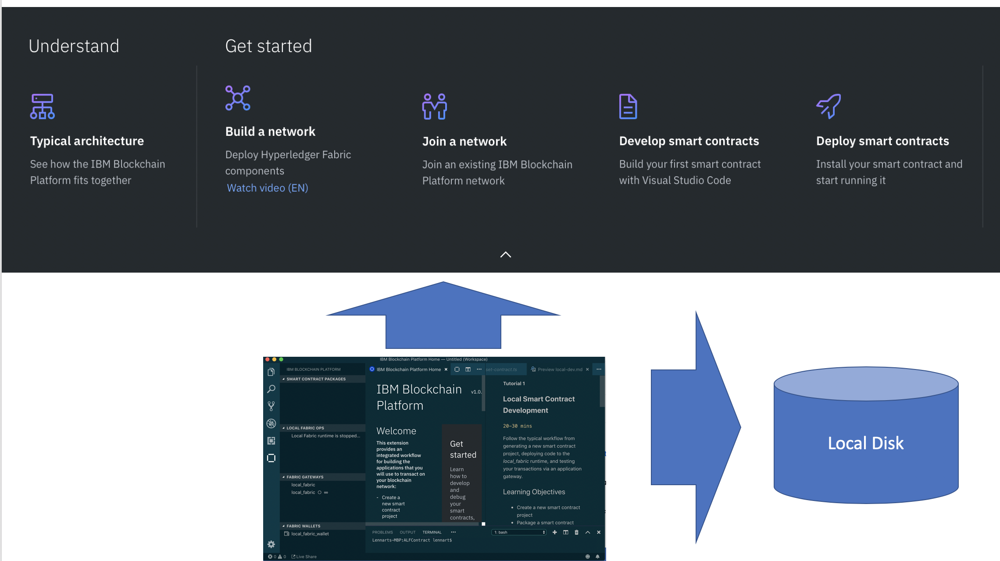
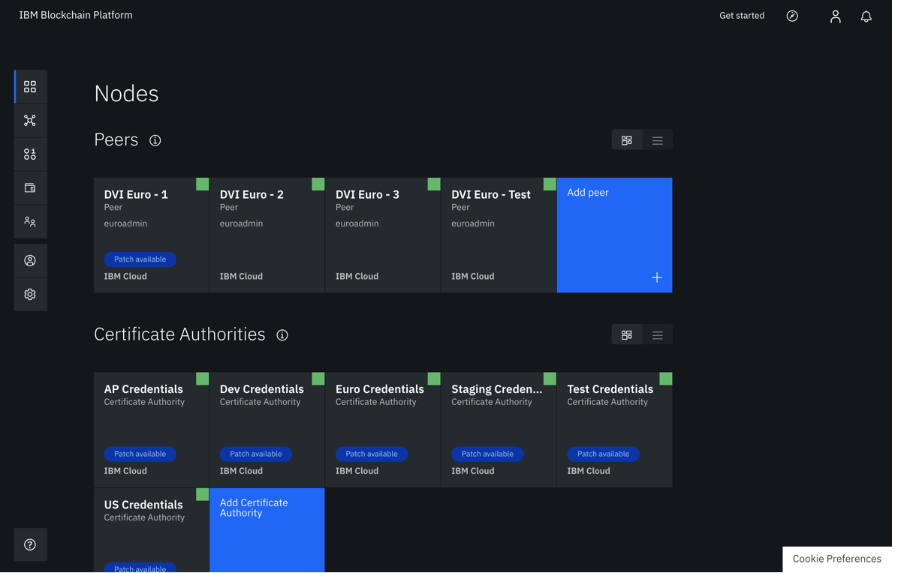

# Event URL: [https://bit.ly/2JisLG9](https://bit.ly/2JisLG9)

# Title: An introduction to the brand new IBM Blockchain Platform 2.0 !

# linkedin.com/in/lennartfrantzell

[Whitelisting](https://cloud.ibm.com/registration/whitelist). 

registration/?cm_

## News

[Does Hyperledger Fabric perform at scale?](https://www.ibm.com/blogs/blockchain/2019/04/does-hyperledger-fabric-perform-at-scale/)

[Forbes: Blockchain Goes To Work At Walmart, Amazon, JPMorgan, Cargill and 46 Other Enterprises](https://www.forbes.com/sites/michaeldelcastillo/2019/04/16/blockchain-goes-to-work/#3aa207de2a40)

[Cargill Hyperledger Grid](https://www.cargill.com/2019/cargill-invests-digital-engineering-to-support-hyperledger-grid)

[Target Blockchain for Supply Chain](https://www.coindesk.com/retail-giant-target-is-working-on-a-blockchain-for-supply-chains)

[Why new off-chain storage is required for blockchains](https://www.ibm.com/downloads/cas/RXOVXAPM)

## IBM Blockchain Twitter feeds:

Christopher Ferris IBM Fellow CTO Open Technology https://twitter.com/christo4ferris

Arnaud J Le Hors. Senior Technical Staff Member: https://twitter.com/lehors

Christian Cachin Swiss Cryptographer, Zurich. https://twitter.com/cczurich?lang=en

IBM Blockchain: https://twitter.com/ibmblockchain?lang=en

Mark Parzygnat.Program Director IBM Blockchain: https://twitter.com/meetmarkp?lang=en

# Learning Objectives:

1. Introduction

1. On your laptop: how to install the IBM Visual Studio Code with the brand new IBP plugin

1. How to create your first Smart Contract with Visual Studio Code

1. How to launch the brand new IBM Blockchain Platform 2.0 in the IBM Cloud

# Learning Objective 1: Introduction

It all started in October during the Global Financial Crisis in 2008 with Satoshi Nakamoto and his paper [BitCoin: A Peer-to-Peer Electronic Cash System](https://bitcoin.org/bitcoin.pdf) which addressed a key problem in electronic commerce:

<i><b>
A purely peer-to-peer version of electronic cash would allow online payments to be sent directly from one party to another without going through a financial institution. 

 
Digital signatures provide part of the solution, but the main benefits are lost if a trusted third party is still required to prevent double-spending. 

We propose a solution to the double-spending problem using a peer-to-peer network.</i></b> 

## Let's start with Hyperledger:

1. #### [https://github.com/hyperledger/](https://github.com/hyperledger/)
1. #### [Hyperledger Fabric Now Supports Ethereum](https://www.hyperledger.org/blog/2018/10/26/hyperledger-fabric-now-supports-ethereum)
1. #### [Cargill Hyperledger Grid for Supply Chain solutions](https://www.hyperledger.org/projects/grid)
1. #### [Hyperledger Caliper Benchmark tool](https://www.hyperledger.org/projects/caliper)
1. #### [Hyperledger Quilt  offers interoperability between ledger systems by implementing the Interledger protocol ](https://www.hyperledger.org/projects/quilt)
1. #### [Hyperledger URSA a shared cryptographic library](https://www.hyperledger.org/projects/ursa)

### [Hyperledger Fabric 1.4.1](https://hyperledger-fabric.readthedocs.io/en/release-1.4/index.html)

Enterprise grade permissioned distributed ledger platform that offers modularity and versatility for a broad set of industry use cases.

1. [Hyperledger Fabric’s First long term support release](https://hyperledger-fabric.readthedocs.io/en/release-1.4/whatsnew.html#raft-ordering-service)

1. [Raft ordering service](https://hyperledger-fabric.readthedocs.io/en/release-1.4/whatsnew.html#raft-ordering-service) 
    Fault Tolerance consensus algorithm     

[Blockchain Use Cases](https://www.ibm.com/blockchain/use-cases/)

[IBM Blockchain Garage Services](https://www.ibm.com/blockchain/garage)

# Learning Objective 2: On your laptop: how to install the IBM Visual Studio Code with the brand new IBP plugin

### [Visual Studio Code](https://code.visualstudio.com)

### [https://marketplace.visualstudio.com/items?itemName=IBMBlockchain.ibm-blockchain-platform](https://marketplace.visualstudio.com/items?itemName=IBMBlockchain.ibm-blockchain-platform)

[An introduction to programming Hyperledger Fabric on SlideShare](https://www.slideshare.net/LennartF/ibp-technical-introduction)

[IBM Blockchain Platform on SlideShare](https://www.slideshare.net/LennartF/ibm-blockchain-platform-explained-149106072)

[IBM Blockchain Solutions on SlideShare](https://www.slideshare.net/LennartF/ibm-blockchain-solutions-149098151)

# Learning Objective 3: Developing smart contracts with Visual Studio Code extension 

[Install IBM Blockchain Platform VS Code extension for free](https://cloud.ibm.com/docs/services/blockchain?topic=blockchain-develop-vscode#develop-vscode-install)

[Download Visual Studio Code](https://code.visualstudio.com/)

[Install IBM Blockchain Platform for VS Code ](https://marketplace.visualstudio.com/items?itemName=IBMBlockchain.ibm-blockchain-platform)

Go through Tutorial One in VS Code: Local Smart Contract Development.

Follow the typical workflow from generating a new smart contract project, deploying code to the <i>local_fabric_runtime</i> and testing your transactions via an application gateway</i> 

# Learning Objective 4: How to launch the brand new IBM Blockchain Platform 2.0 in the IBM Cloud

##  Now let's talk about IBM Blockchain Platform 

### IBM Cloud sign-up link: [https://ibm.biz/BdzMtC](https://ibm.biz/BdzMtC)

[Promocodes](https://www.slideshare.net/LennartF/pcode)

### IBM Cloud Catalog link: [https://cloud.ibm.com/catalog/](https://cloud.ibm.com/catalog)

### IBM Blockchain Platform in the IBM Cloud: [https://cloud.ibm.com/catalog?search=blockchain](https://cloud.ibm.com/catalog?search=blockchain). Select "Blockchain Platform IBM IAM-enabled"

IAM Enabled= "Identity and Access Management"

### [Kubernetes Cluster](https://cloud.ibm.com/kubernetes/catalog/cluster) in the IBM Cloud

<a href="https://cloud.ibm.com/docs/services/blockchain?topic=blockchain-ibp-saas-pricing">Blockchain IBP Pricing</a>
"** Preview the IBM Blockchain Platform at no charge for 30 days when you link your IBM Blockchain Platform service instance to an IBM Cloud Kubernetes free cluster. Performance will be limited by throughput, storage and functionality. IBM Cloud will delete your Kubernetes cluster after 30 days and you cannot migrate any nodes or data from a free cluster to a paid cluster. "

### [Build a Network Tutorial with the IBM Blockchain Platform ](https://cloud.ibm.com/docs/services/blockchain/howto?topic=blockchain-ibp-console-build-network#ibp-console-build-network-sample-tutorial)

# Debugging NPM

1. The application uses Node.js and can sometimes get the wrong version of Node.
1. If npm install gets errors,
1. do: npm rebuild, npm install
1. And if that doesn't work, do:
1. nvm use 8.12.0 npm install or nvm use 8.12.0 npm rebuild npm install
1. the same if npm start gets errors
1 You can also do the same if Visual Studio Code console, Local Fabric Ops pane, do Teardown and Restart Fabric Runtime

## Where do we go from here? 

[June 21: Blockchain Developer Summit](https://blockchain-developer-summit.splashthat.com)
 
[Build a blockchain insurance app](https://developer.ibm.com/patterns/build-a-blockchain-insurance-app/)

[IBM Developer SF Bay Area](https://www.meetup.com/IBM-Developer-SF-Bay-Area-Meetup/)

[IBM SF Bay Area Meetups](https://www.meetup.com/IBM-Developer-SF-Bay-Area-Meetup/events/)
  
